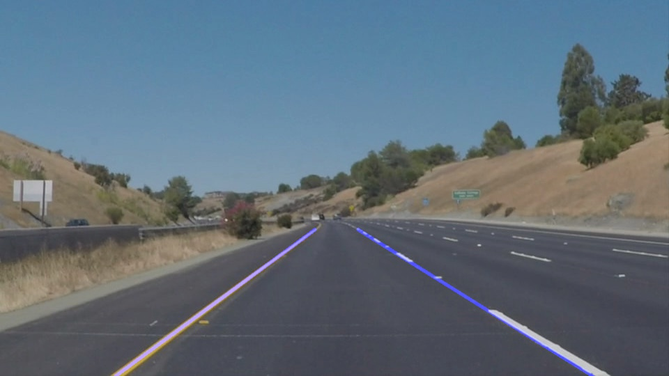
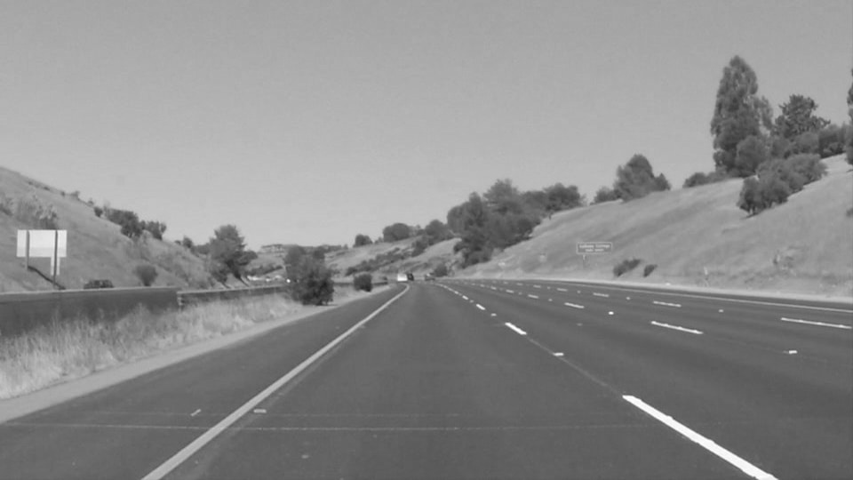
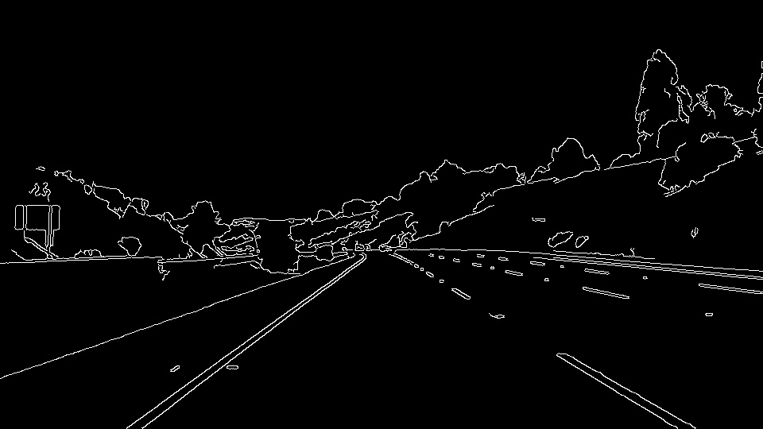
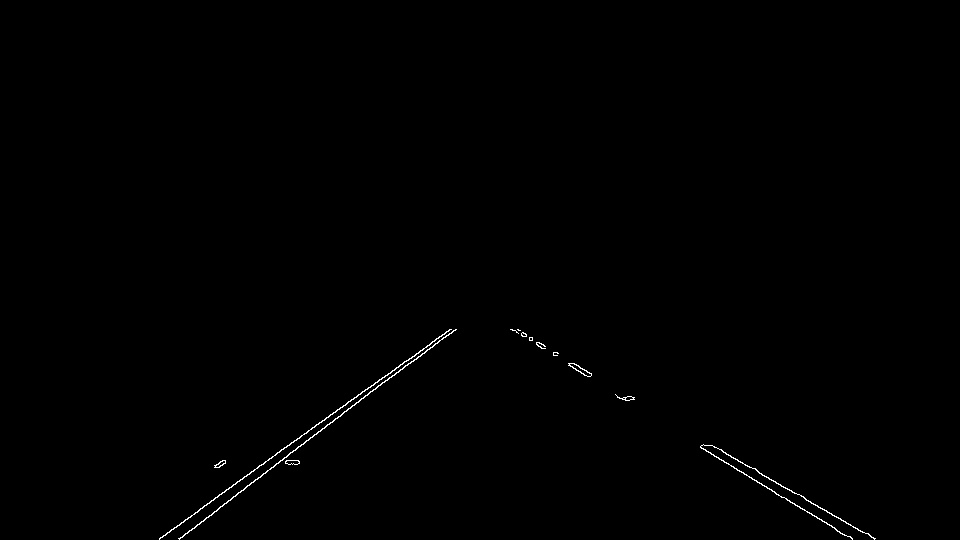
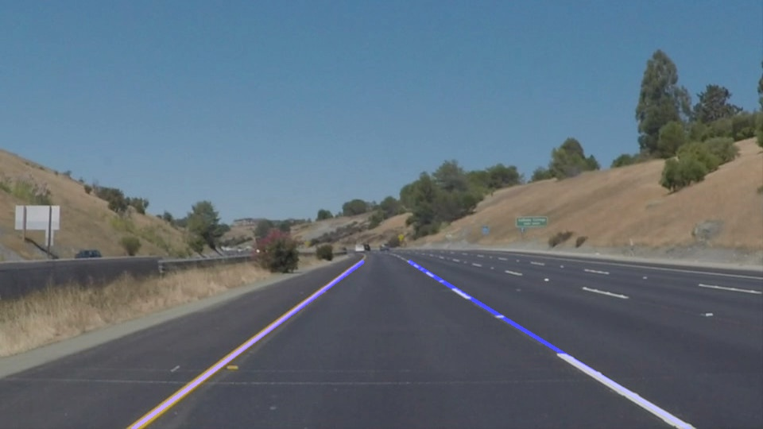
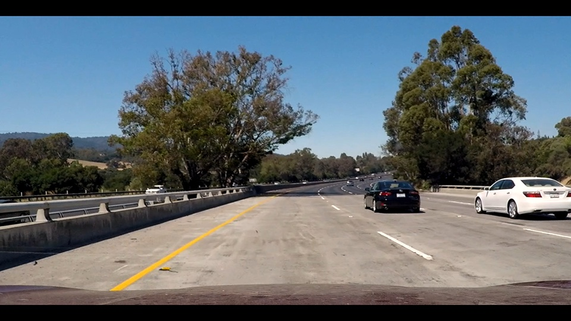
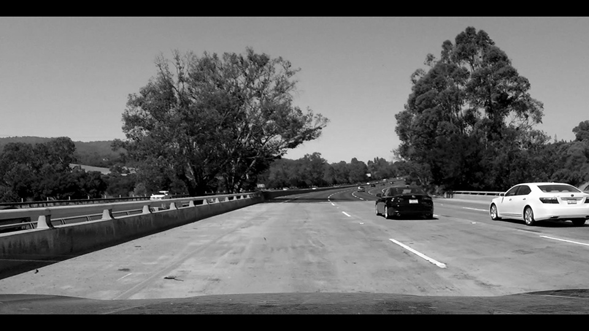

# Self_Driving_Car_FindLaneLine
Project 1 for Udacity Self Driving car nano degree

## Pipeline
My pipeline consists of 6 steps. 
<figure>
 
 <figcaption>
 

 
 
 Original image 
 
 </figcaption>
Step 1, convert the images converted to grayscale 
<figure>
 
 <figcaption>
 

 
 
 Grayscale image 
 
 </figcaption>
Step 2, apply gaussian smoothing on grayscaled images 
Step 3, apply canny edge detection, obtain a set of edges
<figure>
 
 <figcaption>
 

 
 
 Edges afte edge detection 
 
 </figcaption>
Step 4, apply region mask, select edges in desired region
<figure>
 
 <figcaption>
 

 
 
 Edges after region mask 
 
 </figcaption>
Step 5, use Hough transform to find and draw the lines
<figure>
 
 <figcaption>
 

 
 
  Line Segment for lane line in original image 
 
 </figcaption>
</figure>
 

 
Step 6, add the lines on original image
<figure>
 
 <figcaption>
 

 
 
 full text of line
 
 </figcaption>

## Revise Draw_line() function
In order to draw a single line on the left and right lanes, I modified the draw_lines() function by following:
1. compute slop of each edge and group the lines with similar slop, 
2. taking average on all negative slops to get the final slop for left lane line, obtaining the final slop for right lane line in the same way. 
Please see the code in "find_line_fangyan.ipynb" for details.

## Shortcomings with your current pipeline
The main constraint for my current pipeline lies in the draw_lines() function.

First, this program does not work on lane lines at a large angle turn on the road, where the lane line become far away from straight. In that cases, the drawn line does not fit the lane line well enough.

Second, since it is assumed that the left lane line lies in left half image and right lane lies in the right half, the draw_line function may become ineffective for those image in which lane lines are at other positions rather than the normal one.

Additional, some noise may also ruin the result, for example, in the challeng.mp4 video, there are some small yellow line which is close and nearly parallel to the yellow lane line, these slops of these some lines may be computed in averaging the slop of all candidate lines after Hough Transform. If number of these noise lines are large, the result is highly probable to be incorrect.

Besides, in some cases, the lane line become almost invisible after grayscale, like pictures shown below. In that case, this program even fail to find the left lane line, the tuning of parameters of canny and Hough transform does not help either. 
<figure>
 
 <figcaption>
 

 
 
 Original image" 
 
 </figcaption>
 
 <figure>
 
 <figcaption>
 

 
 
 Grayscale image 
 
 </figcaption>
## Possible improvement
To fit the curve line, I have tried seraval methods to overcome the current shortcomings, one way I have tried is to draw more than 1 line at each half of image, but it is hard to decide the starting and ending points of lines with slightly different slops. 

One possible way to improve this is do not average the slops, instead, merge or connect the line segments using starting and ending points on the line, extend the line which is closest to bottom of image to bottom, and extend the line closest to upper limit of region mask to the upper limit. The output may not be very straight, but it should fit the lane line better and works on curve lane.

For noise, further function are needed in order to discriminate these noise, for example, if the current line is much shorted than the line has similar slop, discard it.

For the grayscale problem, I think, in order to improve this, some work has to be done before running grayscale() function. Maybe the color selection is helpful here, that is, only pixel close to yellow and white is reserved.  
