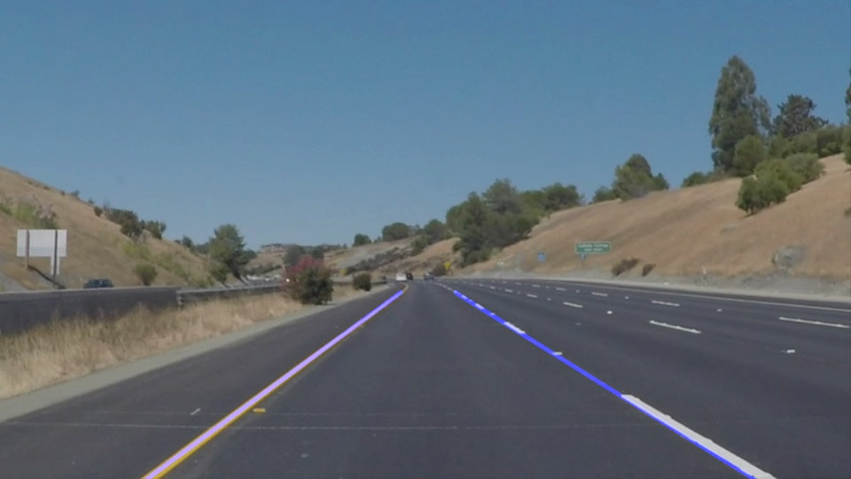
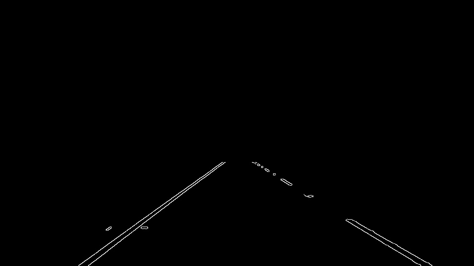

# Self_Driving_Car_FindLaneLine
Project 1 for Udacity Self Driving car nano degree

My pipeline consists of 6 steps. 
<figure>
 
 <figcaption>
 

 
 
 Original image 
 
 </figcaption>
Step 1, convert the images converted to grayscale 
<figure>
 
 <figcaption>
 

 
 
 Grayscale image 
 
 </figcaption>
Step 2, apply gaussian smoothing on grayscaled images 
Step 3, apply canny edge detection, obtain a set of edges
<figure>
 
 <figcaption>
 

 
 
 Edges afte edge detection 
 
 </figcaption>
Step 4, apply region mask, select edges in desired region
<figure>
 
 <figcaption>
 

 
 
 Edges after region mask 
 
 </figcaption>
Step 5, use Hough transform to find and draw the lines
<figure>
 
 <figcaption>
 

 
 
  Line Segment for lane line in original image 
 
 </figcaption>
</figure>
 

 
Step 6, add the lines on original image
<figure>
 
 <figcaption>
 

 
 
 full text of line
 
 </figcaption>
